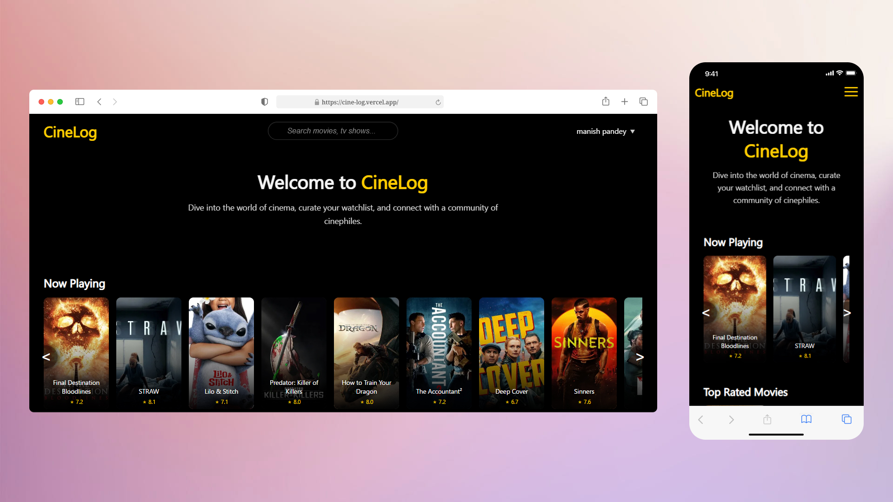

<!-- Badges -->

<p align="center">
  
  
  
  
  
</p>

<h1 align="center"> Dive into the world of cinema               
</h1>




---

## 🚀 Features
CineLog is a sleek, full-featured movie web app powered by [TMDb](https://www.themoviedb.org/) and [Firebase](https://firebase.google.com/).

- 🔐 Google Sign-In (Firebase Auth)
- 📽️ Movie info, posters, and cast from TMDb API
- ⭐ User reviews with ratings (1 review per movie)
- 📋 Personalized Watchlist
- 👤 Public user profiles with reviews & watchlist
- 🔍 Movie search with fuzzy match
- ⚡ Responsive, animated UI with custom CSS
- 🎭 Placeholder avatars using DiceBear

---

## 🔧 Tech Stack

| Purpose           | Stack                                 |
|-------------------|---------------------------------------|
| Frontend          | React, React Router, Vite             |
| Styling           | Custom CSS (Glassmorphism)            |
| Auth & Database   | Firebase Auth, Firestore              |
| Movie Data        | TMDb API                              |

---

## 📁 Repository Structure

```
cinelog/
├── public/                 # Static assets, favicon
├── src/
│   ├── components/         # Reusable UI components
│   ├── context/            # Auth & app context providers
│   ├── pages/              # Route-level pages (Home, Details, Profile, Login)
│   ├── services/           # Firestore functions & Custom React hooks
│   ├── App.jsx             # Route definitions & layout
│   └── main.jsx            # App entry point
├── .env.example            # Environment variables template

```

## 🛠 Getting Started

### 1. Clone and Install

```bash
git clone https://github.com/thatsickusername/cinelog.git
cd cinelog
npm install
```

### 2. Setup Environment

Copy `.env.example` to `.env.local` and fill in:

```env
VITE_TMDB_API_KEY=your_tmdb_api_key
VITE_FIREBASE_API_KEY=...
VITE_FIREBASE_AUTH_DOMAIN=...
...
```

### 3. Start the App

```bash
npm run dev
```

---

## 🔜 Future Possible Enhancements

Here are a few areas this project can be expanded:

- 🎞️ Create user-defined movie Lists (beyond Watchlist)
- 💬 Add comments or likes on reviews
- 👥 Social layer: Follow other users, see their activity
- 📈 Personalized recommendations
- 📱 Mobile app (React Native or Flutter)
- 🌐 Internationalization (i18n)

---

## 🤝 Contributing

Contributions are welcome! I'm open to collaboration and feedback to enhance CineLog further.  
1. Fork the repo  
2. Create a feature branch  
3. Open a pull request  

---

## 📜 License

This project is licensed under the **MIT License**.  
See [LICENSE](./LICENSE) for details.

---

<p align="center">
  Built with ❤️ by Manish Pandey
</p>
